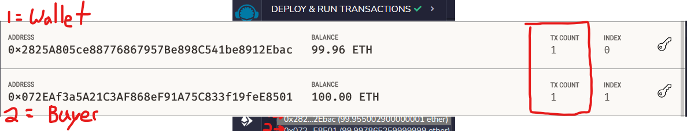

# RBC-HW21-Advanced-Solidity-Challenge

## Advanced Solidity Challenge Module
Note: All related development has been applied to one solidity file within the "Starter Code" folder

## Please see below graphical demos of the deployed Smart Contract commands
Note: All  blockchain commands and contracts were rendered on Remix (IDE)

### Evaluation Evidence:

### Step 1: Compile and Deploy to pull in required addresses

### Step 2: Assign required addresses to specific contract components and deploy each

### Step 3: Confirm functionality and verify accuracy of each contract deployed and corresponding attributes

### Step 4: Switch lead transaction account and validate successful use of the "buyTokens" function to ascertain the new Token Buyer/Recipient addresses and verify the integrity of the exchange between the related accounts

